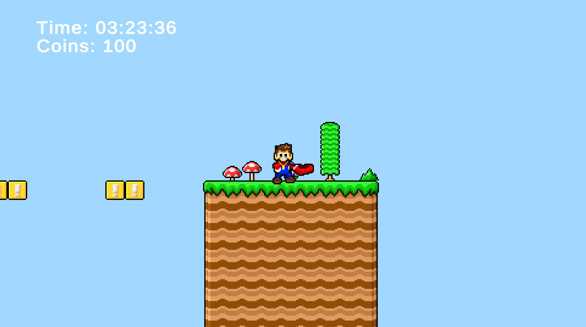

# Mario's Coin Adventure

A 2D puzzle-platformer inspired by classic Mario mechanics. In this adventure, players must navigate a hazard-filled level, solve platforming challenges, and collect all 100 hidden coins to unlock the path to the final star.

## Game Overview

- **Genre**: Puzzle-Platformer
- **Objective**: Collect all 100 coins scattered across the level to unlock the final path and reach the star to complete the level.
- **Hazards**: Bottomless pits reset the level if the player falls in.
- **Mechanics**: Break bricks, hit lucky blocks, wall jump to reach high places, and solve platforming puzzles to collect coins.

## Controls

- `← →` : Move Left/Right
- `Spacebar` : Jump (hold to jump higher)
- `ESC` : Toggle Pause Menu

### Wall Jumping

To perform a wall jump:

- Move toward a wall until Mario "grabs" the wall (you'll see a slower falling speed and a grab animation).
- While in the grab animation, press `Spacebar` to jump off the wall.
- Wall jumps can be chained together and are required to collect high-up coins or recover from near falls.

## Key Gameplay Features

- **Interactive Blocks**:
  - Hit lucky blocks to reveal coins.
  - Break bricks to clear paths and discover hidden areas.
- **Final Puzzle Mechanic**:

  - Near the end of the level, a large pit with invisible block outlines can only be crossed after collecting all 100 coins, making exploration and collection essential.

- **Built-In UI**: Displays elapsed time and coin count for progress tracking.

## 📷 Screenshots




## 🧾 Credits

- **Tilemap**: [Spriters Resource - Mario Custom Tileset](https://www.spriters-resource.com/custom_edited/mariocustoms/sheet/64266/)
- **Mario Sprite Sheet**: [DeviantArt - SMBHotS Mario Sprite Sheet by KratosGoji91](https://www.deviantart.com/kratosgoji91/art/SMBHotS-Mario-Sprite-Sheet-FINAL-VERSION-900005442)
- **In Game Music**: [Youtube](https://youtu.be/XiSipmNEFo0?list=RDXiSipmNEFo0)
- **All other music, sound effects and art are owned by Nintendo**

## How to Play

### 1. Clone this repository

```bash
git clone https://github.com/NicoM-7/marios-coin-adventure.git
cd marios-coin-adventure/Build
```

### 2. Click on Marios_Coin_Adventure.exe
